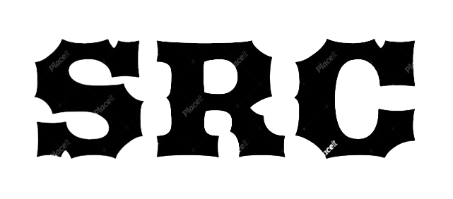

<a name="readme-top">

<br/>

<br />
<div align="center">
  <!-- TODO: If you want to add logo or banner you can add it here -->
    
  </a>
<!-- TODO: Change Title to the name of the title of your Project -->
  <h3 align="center">WEBSITE PORTFOLIO</h3>
</div>
<!-- TODO: Make a short description -->
<div align="center">
  Welcome to my personal portfolio website! Explore my Home page for an introduction, learn more about my background and experiences in the About Me section, and see my work and achievements on the Projects page. Discover my skills and interests, and check out the Credits page to see the resources and contributions that have supported my journey.
</div>

<br />

<!-- TODO: Change the zyx-0314 into your github username  -->
<!-- TODO: Change the WD-Template-Project into the same name of your folder -->


---

<br />
<br />

<!-- TODO: If you want to add more layers for your readme -->
<details>
  <summary>Table of Contents</summary>
  <ol>
    <li>
      <a href="#overview">Overview</a>
      <ol>
        <li>
          <a href="#key-components">Key Components</a>
        </li>
        <li>
          <a href="#technology">Technology</a>
        </li>
      </ol>
    </li>
    <li>
      <a href="#rule,-practices-and-principles">Rules, Practices and Principles</a>
    </li>
    <li>
      <a href="#resources">Resources</a>
    </li>
  </ol>
</details>

---

## Overview

<!-- TODO: To be changed -->
My website features a comprehensive navigation menu with sections including Home, About, Projects, Skills and Interests, and Credits. The Home page provides links to my social media profiles like Instagram (IG) and Facebook (FB). The About section offers detailed insights into my background and personal information. Moving on to Projects, visitors can explore a collection of my projects displayed in containers. Each project container includes buttons for deployment and accessing the repository, along with an option to button down for convenient navigation. The Skills and Interests section showcases my areas of expertise and personal interests. Lastly, the Credits page acknowledges the individuals and resources that have contributed to my journey in design and beyond.

### Key Components
<!-- TODO: List of Key Components -->
Navigation Menu: Includes links to essential sections such as Home, About, Projects, Skills and Interests, and Credits. This menu facilitates easy navigation throughout the site.

Home Page: Features social media links (e.g., Instagram, Facebook) prominently displayed for easy access. This page serves as an entry point to the rest of the website.

About Section: Provides comprehensive information about yourself, covering personal details and background information.

Projects Section: Displays a collection of your projects in containers. Each project container includes functionalities such as deployment links, repository access, and a scroll-up button for user convenience.

Skills and Interests: Highlights your skills and personal interests, giving visitors insights into your areas of expertise and passion.

Credits Section: Acknowledges and gives thanks to individuals and resources that have played a significant role in your design journey and beyond.

## Deployment link
https://silascoroza.github.io/WD_FINAL_PROJECT-main/

## Links of other Projects

- HANDS ON 2
https://github.com/silascoroza/WD-HandsOn02-Project.git
- Seatwork 3
https://github.com/silascoroza/WD-SEATWORK3-PROJECT.git
- Activity 1
https://github.com/silascoroza/WD-activity-1.git
- Seatwork 2
https://github.com/silascoroza/WD-sw-2.git
- Midterm Activity
https://github.com/silascoroza/WD-Midterm.git
- Seatwork 4
https://github.com/silascoroza/WD_SW4_PROJECT-main.git

## Wakatime
https://wakatime.com/projects/WD_FINAL_PROJECT


### Technology
<!-- TODO: List of Technology Used -->


## Rules, Practices and Principles
1. Always use `WD-` in the front of the Title of the Project for the Subject followed by your custom naming.
2. Do not rename any .html files; always use `index.html` as the filename.
3. Place Files in their respective folders.
4. All file naming are in camel case.
   - Camel case is naming format where there is no white space in separation of each words, the first word is in all lower case while the succeding words first letter are in upper followed by lower cased letters.
   - ex.: buttonAnimatedStyle.css
5. Use only `External CSS`.
6. Renaming of Pages folder names are a must, and relates to what it is doing or data it holding.
7. File Structure to follow below.

```
WD_FINAL_PROJECT-main
└─ assets
|   └─ css
|   |   └─ style.css
|   └─ img
|   |   └─ image1.jpg
|   |   └─ image2.jpg
|   |   └─ image3.jpg
|   |   └─ image4.png
|   └─ js
|       └─ script.js
└─ pages
|  └─ about
|  |  └─ assets
|  |  |  └─ css
|  |  |  |  └─ style.css
|  |  |  └─ img
|  |  |  |  └─ about-image1.jpg
|  |  |  |  └─ about-image2.jpg
|  |  |  |  └─ about-image3.jpg
|  |  |  |  └─ about-image4.png
|  |  |  └─ js
|  |  |     └─ script.js
|  |  └─ index.html
|  └─ projects
|  |  └─ assets
|  |  |  └─ css
|  |  |  |  └─ style.css
|  |  |  └─ img
|  |  |  |  └─ project-image1.jpg
|  |  |  |  └─ project-image2.jpg
|  |  |  |  └─ project-image3.jpg
|  |  |  |  └─ project-image4.png
|  |  |  └─ js
|  |  |     └─ script.js
|  |  └─ index.html
|  └─ skills-and-interests
|  |  └─ assets
|  |  |  └─ css
|  |  |  |  └─ style.css
|  |  |  └─ img
|  |  |  |  └─ skills-image1.jpg
|  |  |  |  └─ skills-image2.jpg
|  |  |  |  └─ skills-image3.jpg
|  |  |  |  └─ skills-image4.png
|  |  |  └─ js
|  |  |     └─ script.js
|  |  └─ index.html
|  └─ credits
|  |  └─ assets
|  |  |  └─ css
|  |  |  |  └─ style.css
|  |  |  └─ img
|  |  |  |  └─ credits-image1.jpg
|  |  |  |  └─ credits-image2.jpg
|  |  |  |  └─ credits-image3.jpg
|  |  |  |  └─ credits-image4.png
|  |  |  └─ js
|  |  |     └─ script.js
|  |  └─ index.html
└─ index.html
└─ readme.md

```

## Resources

<!-- TODO: Add References -->
| Title | Purpose | Link |
|-|-|-|
| Youtube | For invaluable tutorials and creative insights   | https://www.youtube.com/ |
| Pinterest | Image Source | https://ph.pinterest.com/pin/13581236381228045/ |
| Google Fonts | For elevating my typography game | https://fonts.google.com/ |
| Fontawesome | For enhancing visual appeal with icons | https://fontawesome.com/icons/facebook?f=brands&s=solid |
| Removebg | For Background Removal | https://www.remove.bg/upload |
